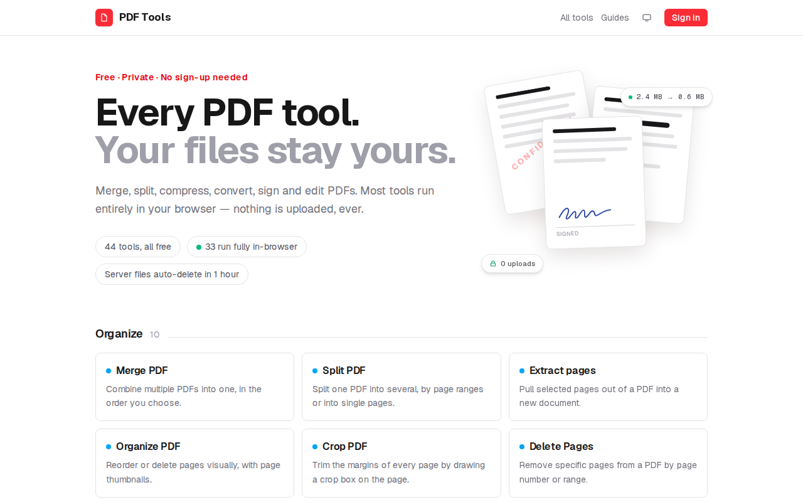

<h1 align="center">📄 PDF Tools</h1>

<p align="center">
  <strong>Every PDF tool you need — and your files never leave your browser.</strong>
</p>

<p align="center">
  <a href="https://thepdftool.in"><b>🔗 Live at thepdftool.in</b></a>
</p>

**44 free PDF tools** — merge, split, compress, convert, edit, sign, fill forms,
OCR and more. **33 of them run entirely in your browser** (via `pdf-lib` and
`pdf.js`), so your documents are never uploaded. No sign-up, no watermarks, no
page limits. Open-source and self-hostable.

> A private, open-source alternative to iLovePDF / Smallpdf.

<p align="center">
  
</p>

### Why it's different

- 🔒 **Private by default** — most tools run 100% client-side. Turn off your
  network after the page loads and merging, editing, even OCR still work; the
  file stays on your device.
- 🧰 **44 tools** across organize, convert, edit & sign, optimize, and security.
- ✍️ **Real text editing** — inline edits genuinely remove the original text
  from the PDF and redraw it in the document's own font, not a white box on top.
- 🔤 **Client-side OCR** — turn scanned/image-only PDFs into editable text,
  in-browser, with no upload.
- 🧩 **Workflows** — chain tools into a **pipeline**, or **batch** one tool
  across many files at once.
- 🏠 **Self-hostable** — the whole stack is one `docker compose` deploy on a
  single VPS (see [Production](#production)).

For the handful of tools that need heavy engines (Office conversions, OCR
service, encryption), files upload over an encrypted connection to a queued
worker and are **auto-deleted within an hour**.

## Tools

**Client-side** (private by design — 33 tools):

- Organize: merge, split, extract pages, delete pages, rotate, organize
  (visual reorder), crop, N-up (pages per sheet), resize (A4/Letter),
  pipeline (chain steps into one workflow), batch (one tool across many files)
- Convert: JPG→PDF, PDF→JPG, PDF→PNG, PDF→Text/Markdown, PDF→Excel/CSV,
  extract images
- Edit: edit (inline text / boxes / highlights / images), replace image, sign,
  fill forms, flatten, redact, watermark, page numbers, header/footer, Bates
  numbering, edit metadata, annotate (comments + highlights), compare (text),
  visual compare (pixel)
- Optimize: grayscale
- Security: sanitize (strip metadata)

The editor (edit / sign / redact / fill forms) works on rotated (`/Rotate`)
pages: detection, overlays, and exports are all rotation-aware.

**Server-side** (Docker engines — 11 tools): compress, Office→PDF, PDF→Word,
PDF→PowerPoint, HTML→PDF, protect, unlock, OCR, repair, PDF/A, optimize-for-web
(linearize).

## Development

```bash
cp .env.example .env.local   # then set AUTH_SECRET (openssl rand -base64 32)
docker compose up -d         # redis + gotenberg + job worker
npm install
npm run dev                  # app on http://localhost:3000
```

In development a fake "Dev login" provider is available to test the
signed-in tier. Real OAuth (Google/GitHub) activates when the AUTH_* env
vars are set — see `.env.example`.

```bash
npm test        # unit tests (engine ops, validation, diff)
npm run lint
npm run build
```

## Production

On the VPS (needs Docker + ports 80/443 open):

```bash
git clone <this repo> && cd pdf
echo "AUTH_SECRET=$(openssl rand -base64 32)" > .env
./deploy.sh
```

That's the whole deploy — Caddy fronts everything and the stack serves on
`http://<vps-ip>`. When you buy a domain:

```bash
# 1. point the domain's A record at the VPS IP, then:
echo "SITE_DOMAIN=your-domain.com" >> .env
echo "NEXT_PUBLIC_SITE_URL=https://your-domain.com" >> .env
./deploy.sh   # Caddy provisions Let's Encrypt TLS automatically
```

Re-run `./deploy.sh` after any code update. Monitor `GET /api/health`;
sitemap at `/sitemap.xml`.

## Architecture

- `src/lib/tools/registry.ts` — every tool is a `ToolDefinition`; the generic
  UI (upload → options → run → download) is driven entirely by these entries.
  Adding a tool = one definition + one processor function.
- `src/lib/guides/content.ts` — data-driven how-to guides at `/guides`
  (SEO/top-of-funnel content); each entry generates a static page with Article +
  FAQ structured data and links to the relevant tool.
- `src/lib/engine-client/` — pdf-lib/pdfjs implementations; pdf-lib ops run in
  a Web Worker (`src/workers/pdf.worker.ts`), rendering runs on the main thread.
- `src/lib/engine-server/` — `execFile` wrappers for Ghostscript, qpdf,
  ocrmypdf, LibreOffice, plus the Gotenberg HTTP client.
- `src/app/api/jobs/` — upload (validated by magic bytes, rate-limited,
  tier-quota'd) → BullMQ → `src/worker/index.ts` → poll → download.
- Quotas: anonymous 10 jobs/day (50 MB/file), signed-in 50/day (100 MB/file),
  enforced in Redis. Client-side tools are unlimited.

## Security properties

- Server files stored under synthetic UUID paths, deleted after 1 hour.
- Uploads validated by magic bytes, never by extension alone.
- All engine shell-outs use argument arrays (`execFile`) — no shell strings.
- Internal error details stay in worker logs; users see friendly messages.
- No secrets in the repo — runtime config only via env.

## Not yet built

Stripe/premium billing, i18n, S3/R2 storage backend (single-host disk storage
today), cryptographic signatures (signing is visual). PDF→Excel is heuristic
(text-layer table detection), so complex layouts may need cleanup. The editor
can now OCR scanned pages in-browser (tesseract.js) to make them editable, but
only Latin script is bundled; CJK/Arabic inline editing is still unsupported.
